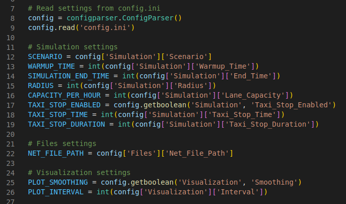

# Autonomous Taxi Fleet Hack

## Setup
1. Clone the repository https://github.com/jayaratned/sumo-paper-grid.git
2. Create a virtual environment using Python 3.10.12 and activate it

    - `sudo apt install python3.10-venv`

    - `python3.10 -m venv venv`

    - `source venv/bin/activate`

3. Install the requirements
    - `pip install -r requirements.txt`
4. Add line export `SUMO_HOME=/path-to-project-directory/sumo-paper-grid/env/lib/python3.10/site-packages/sumo` to `env/bin/activate` file and source it
5. Create `sumo_tools_path.conf` in sumo-scripts directory and add path to sumo-tools directory
    - for example: `/home/don/src/projects/sumo-paper-grid/env/lib/python3.10/site-packages/sumo/tools`
6. Check `config.ini` file and run the simulation:
    - `python main.py`

## Overview
[add overview]

## main.py
  
Importing all the necessary modules and files from utils directory sumo_utils.py, vehicle_utils.py, visualization_utils.py and config.ini file.

  
Reads the config.ini file and sets the simulation parameters.

### `setup_simulation()` function
This function calls the `su.setup_sumo(scenario=SCENARIO, sumo_gui=SUMO_GUI, sumo_config_file=CONFIG_FILE)` function in the sumo_utils.py file. The arguments scenario, sumo_gui bool, and sumo_config_file are passed from the config.ini file. 

### run_main_simulation()
[add run_main_simulation functionality]
### post_process_results(TAXI_STOP_ENABLED)
[add post_process_results functionality]

## sumo_utils.py
### `register_observer(func)` function
This function registers the observer function to the simulation. The observer function is called at every simulation step. The observer function is defined in the main.py file.

### `unregister_observer(func)` function
This function unregisters the observer function from the simulation. The observer function is defined in the main.py file.

### `clear_observers()` function
This function clears all the registered observers from the simulation.

### `setup_sumo(scenario, sumo_gui, sumo_config_file)` function
The `setup_sumo` function in `sumo_utils.py` is responsible for setting up the SUMO simulation environment. It takes three arguments: `scenario`, `sumo_gui`, and `sumo_config_file`. 

The function first checks if the `SUMO_HOME` environment variable is set, and if not, it exits with an error message. It then adds the SUMO tools directory to the system path and determines the name of the SUMO binary to use based on whether the simulation is being run with the SUMO GUI or not. 

If the simulation is being run within a virtual environment, the function sets the path to the SUMO binary within the virtual environment. Otherwise, it sets the path to the SUMO binary in the default location (`/home/don/.local/bin`). If the binary is not found in the default location, the function exits with an error message.

Finally, the function starts the SUMO simulation using the `traci.start` function, passing in the path to the SUMO binary and the path to the SUMO configuration file for the specified scenario.

### `run_simulation(simulation_end_time)` function
Runs the SUMO simulation until the specified end time is reached. This function takes one argument: `simulation_end_time` (the time at which the simulation should end).

The `run_simulation` function is the main function of the module and is used to run the SUMO simulation. It takes the simulation end time as an argument and executes the observer functions at every simulation step until the end time is reached. It then outputs the simulation runtime and closes the SUMO environment.

The module also contains a list of observer functions (`observers`) that can be registered using the `register_observer` function. These functions are executed at every simulation step and can be used to perform custom actions during the simulation.

## vehicle_utils.py
[add vehicle_utils.py functionality]
### stop_all_taxis_at_current_position(stop_time, stop_duration)
[add stop_all_taxis_at_current_position functionality]

### get_edges_near_stopped_taxis(radius)
[add get_edges_near_stopped_taxis functionality]

### write_edges_to_file(nearby_edges, output_path="data/outputs/edges_near_stopped_taxis.txt")
[add write_edges_to_file functionality]

### run_plot_net_selection(input_file, net_file)
[add run_plot_net_selection functionality]

## visualization_utils.py
### collect_simulation_data(radius=100, warmup_time=0)
[add collect_simulation_data functionality]
### plot_collected_data(start_time, warmup_time, end_time, data_type="all", interval=300, smoothing=False)
[add plot_collected_data functionality]

## config.ini
[add config.ini functionality]
